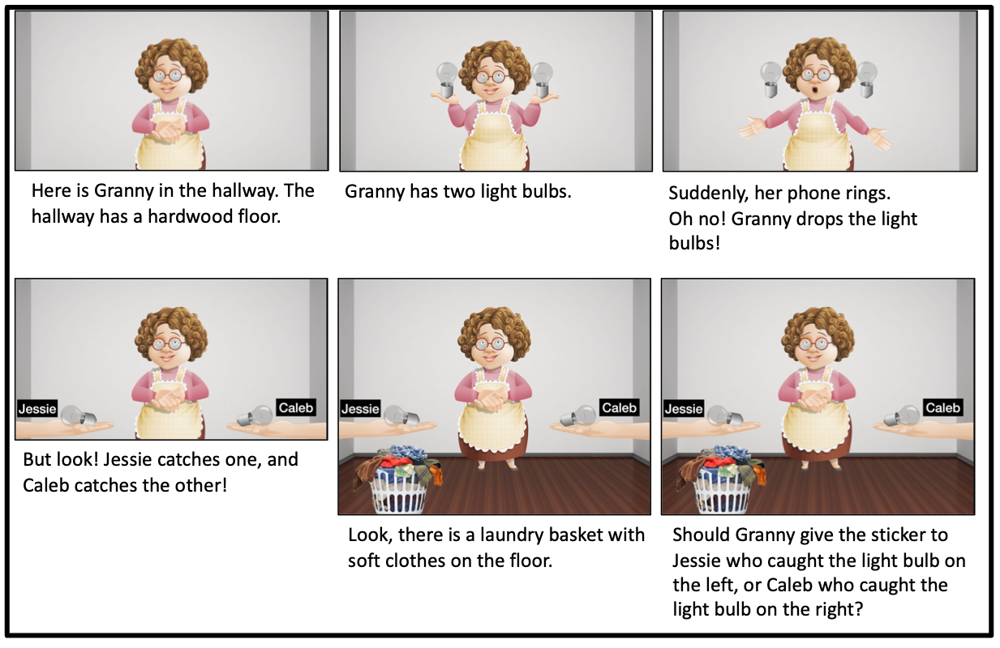

# Probing counterfactual thinking without counterfactual langauge

This repository contains the experiments, data, analyses, and figures for the paper "Probing counterfactual thinking without counterfactual langauge," by David Rose, Siying Zhang, Sophie Bridgers, Hyowon Gweon and Tobias Gerstenberg.

<!-- The preprint can be found [here](update link) -->

__Contents__:
- [Probing counterfactual thinking without counterfactual langauge](#probing-counterfactual-thinking-without-counterfactual-langauge)
	- [Introduction](#introduction)
	- [Repository structure](#repository-structure)

## Introduction



<br clear="left" />
<br clear="right" />

Counterfactual thinking---thinking about how things could have gone differently---is a fundamental cognitive capacity that underlies many aspects of our everyday lives; it allows us to learn from past mistakes, evaluate our own and others' actions, and imagine a world beyond the here and now. Yet, prior work has yielded a strikingly wide developmental window for the onset of counterfactual thinking: as early as 2, and as late as 12. There are at least two reasons for this: reliance on counterfactual language (which can underestimate children's competence), and a failure to distinguish counterfactual thinking from hypothetical thinking (which can overestimate children's competence). The current work presents a novel paradigm for probing genuine counterfactual thinking that does not require counterfactual language. After watching a scenario where Granny drops two items that are caught by two different characters, participants are asked which of the two characters Granny should thank. Across three experiments that implement different versions of the task to rule out alternative accounts, we find that the capacity for genuine counterfactual thinking may be present by around age 5, while younger children may succeed on tasks that can be solved via hypothetical thinking. By offering an intuitive and practical method for assessing counterfactual thinking without counterfactual language, the current work opens up a range of empirical questions about the interplay between the development of counterfactual thinking and other cognitive capacities.


## Repository structure

```
├── code
│   ├── R
│   ├── experiments
│   │   ├── experiment1
│   │   ├── ...
├── data
│   ├── experiment1
│   ├── experiment1_appendix
│   ├── experiment2
│   └── experiment3
├── docs
│   ├── experiment1
│   ├── experiment2
│   └── experiment3
├── figures
│   ├── diagrams
│   ├── experiment1
│   ├── experiment1_appendix
│   ├── experiment2
│   └── experiment3


```

- `code/` contains all the code for the experiments, analyzing data and generating figures.
  - `experiments` contains code for each experiment that was run. Pre-registrations for all experiments may be accessed via the Open Science Framework [here](UPDATE). All experiments with adults were run in jsPsych and all experiments with children were run in Lookit. 
	- `experiment1` 
		- adults ([pre-registration](https://osf.io/yqvfz)) 
		- children ([pre-registration](https://osf.io/sdbx7)) 
	- `experiment1_appendix` 
		- children ([pre-registration](https://osf.io/v49te)) 
	- `experiment2` 
		- adults ([pre-registration](https://osf.io/ytjsp)) 
		- children ([pre-registration](https://osf.io/r52dt))
	- `experiment3` 
		- adults ([pre-registration](https://osf.io/mwb9e)) 
		- children ([pre-registration](https://osf.io/e8pqt))  	 
- `R` contains the analysis scripts that were used to analyze data and generate figures
	 (view a rendered file [here](https://davdrose.github.io/counterfactuals_dev/)).
- `data/` contains anonymized data from all experiments
- `docs/` contains all the experiment code for the adult versions of each experiment. You can preview the experiments below:
	- [experiment1](https://davdrose.github.io/counterfactuals_dev//experiment1/index.html),
	- [experiment2](https://davdrose.github.io/counterfactuals_dev//experiment2/index.html),
	- [experiment3](https://davdrose.github.io/counterfactuals_dev//experiment3/index.html)
- `figures/` contains all the figures from the paper (generated using the script in `code/R/`). 
